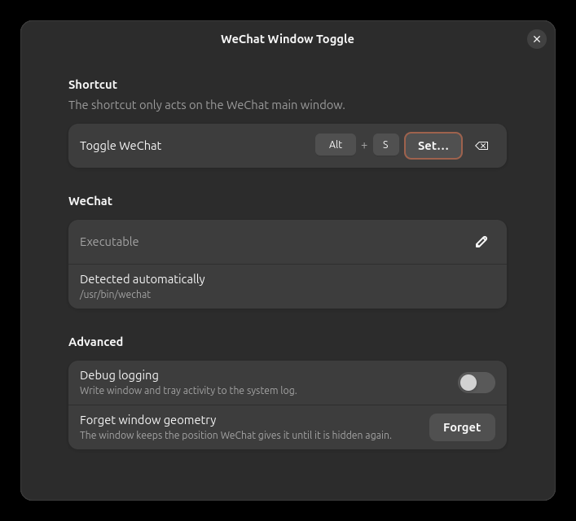
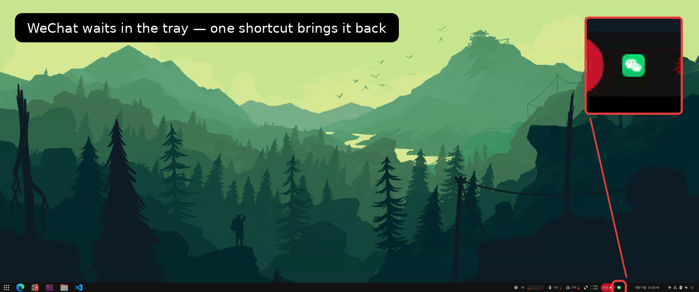
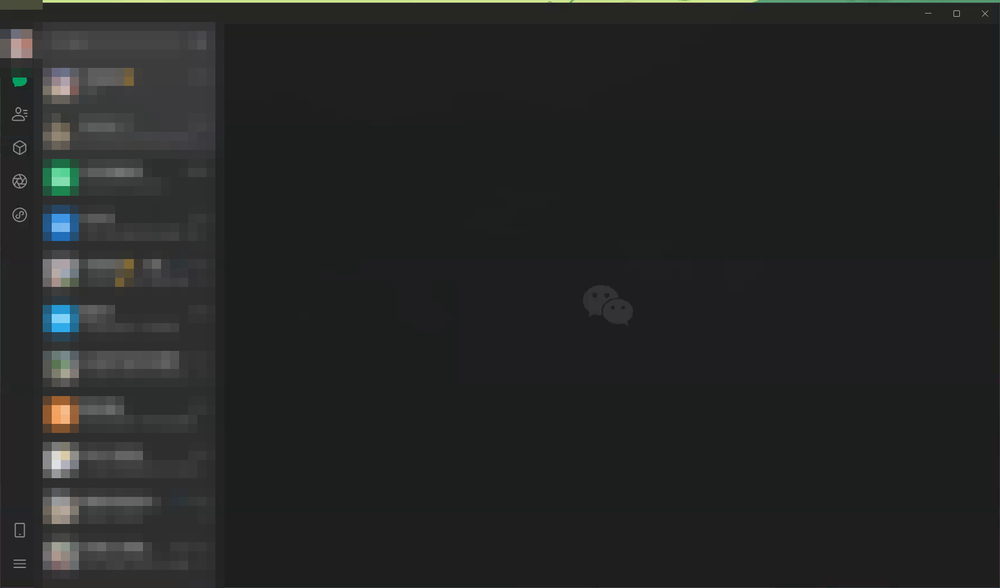

# WeChat Window Toggle

[](https://github.com/CoderLeoX/gnome-shell-extension-wechat-toggle/actions/workflows/check.yml)

A GNOME Shell extension that shows and hides the **WeChat for Linux** main window with a
single keyboard shortcut, and gives the window back its previous position and size.

WeChat 4.x for Linux draws its own window and it is a native Wayland window, so the usual
X11 tools (`xdotool`, `wmctrl`, `xprop`) can neither see nor control it. This extension
runs inside GNOME Shell and uses the only two channels WeChat offers: its tray icon to
show the window, and a close request to hide it.

## Requirements

- GNOME Shell 45 or newer, in a **Wayland** session (an X11 session has better options)
- WeChat for Linux 4.x
- `glib-compile-schemas` when installing from source

## Installation

### From source

```bash
git clone https://github.com/CoderLeoX/gnome-shell-extension-wechat-toggle.git
cd gnome-shell-extension-wechat-toggle
./install.sh       # then log out and back in
```

A newly installed extension is only picked up when the Shell starts, and a Wayland session
cannot be reloaded in place, so logging out once is part of the installation.

### From extensions.gnome.org

Not published yet — the submission is being prepared.

## Usage

The default shortcut is <kbd>Alt</kbd>+<kbd>s</kbd>.

| State of WeChat | What the shortcut does |
| --- | --- |
| Main window visible | Asks the window to close, which sends it to the tray |
| Hidden in the tray | Clicks its tray icon, so the window returns where it was |
| Not running | Nothing happens: the extension does not start WeChat for you |

> **Important:** hiding relies on WeChat's own behaviour of minimizing to the tray when
> its window is closed. Keep *Settings → General → Close window → minimize to tray*
> enabled, otherwise the shortcut quits WeChat instead of hiding it.

## Screenshots



The window comes back with the size and position it had before it was hidden, and waits in
the tray in between:





The conversation list is pixelated on purpose in these images.

## Preferences

```bash
gnome-extensions prefs wechat-toggle@coderleox.github.io
```

- **Shortcut** – any key combination with at least one modifier
- **Debug logging** – off by default; everything the extension does is silent unless this
  is enabled
- **Forget window geometry** – drops the remembered position and size

## How it works

1. **Hiding** is a close request (`Meta.Window.close()`/`delete()`). WeChat turns that into
   "minimize to the tray" by itself. There is no DBus method to hide the window, which is
   why hiding and showing are not symmetrical.
2. **Showing** replays a click on WeChat's tray icon: the extension lists the session bus
   names, resolves the owner of each `org.kde.StatusNotifierItem-*` name with
   `GetConnectionUnixProcessID`, checks `/proc/<pid>/comm` to make sure the item belongs to
   WeChat, and calls `Activate` on it. With no such item WeChat is not running and nothing
   happens: the extension never starts the client itself.
3. **Window geometry** is stored in GSettings when the window is hidden and applied again
   when WeChat recreates the window. It is enforced for a few seconds afterwards, because
   WeChat sets its own size once login finishes. The geometry is only taken from a window
   that is neither too small nor maximized: a maximized window reports the whole work area,
   and restoring that size is what makes Mutter bring a window back maximized. A window is
   also never touched once it has left the window stack, which used to crash the Shell.
   To avoid a visible jump, a window created right after WeChat's tray icon was clicked is
   recognised by the process id that owns that icon and placed twice: once right away, and
   again when the Shell maps it. A geometry set before the client's first commit does not
   survive that commit, and mapping happens just before the first frame is painted.
4. **The login window trap.** Before the main window, WeChat briefly shows a small
   login/auto-login window (280×380 in practice) that uses the *same* WM class and title.
   It is deliberately left alone: it cannot be resized anyway, and remembering its geometry
   is what used to make the main window shrink right after login.

## Known limitations

- WeChat must be started once before the shortcut can find its tray icon; the very first
  start after login is done by the extension itself.
- The extension is tied to WeChat's Linux desktop client and its tray icon implementation.
- Changing `extension.js` requires a logout/login to take effect.
- Developed and tested on GNOME Shell 50.1 (Ubuntu, Wayland) with WeChat for Linux 4.1.9.
  Older Shell versions are declared in `metadata.json` but have not been verified — reports
  are welcome.

## Troubleshooting

Enable *Debug logging* in the preferences, then watch the Shell log:

```bash
journalctl -f -o cat /usr/bin/gnome-shell | grep wechat-toggle
```

Check that WeChat registered its tray icon:

```bash
busctl --user list | grep StatusNotifierItem
```

Check that the extension is enabled:

```bash
gnome-extensions info wechat-toggle@coderleox.github.io
```

## Contributing

Bug reports and pull requests are welcome. When something does not work, the debug log
above plus the Shell version, the WeChat version (`wechat --version`) and the session type
(`Wayland`/`X11`) make a problem much easier to reproduce.

## License

GPL-2.0-or-later, see [LICENSE](LICENSE).

This is an unofficial extension. It is not affiliated with, endorsed by or supported by
Tencent. "WeChat" and "微信" are trademarks of Tencent Holdings Ltd., used here only to
describe what the extension works with.
